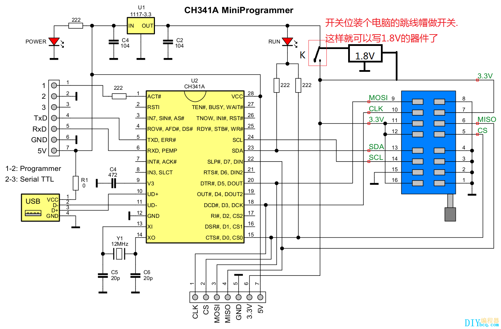

# CH341A_Mini_Programmer
hardward, software used for  

### sotfware used
https://github.com/xiaolaba/UsbAsp-flash_AsProgrammer  
2.03a

### hardward used
CH341A Mini Programmer 土豪金  
原來5V, 改成 3.3V IO  

REF:  

https://bbs.pigoo.com/thread-84511-1-1.html  
http://diybcq.com/thread-144131-1-1.html  
https://www.onetransistor.eu/2017/08/ch341a-mini-programmer-schematic.html  

### driver
http://www.wch.cn/downloads/CH341PAR_EXE.html  
http://www.wch.cn/downloads/CH341SER_EXE.html

### CH341PAR.EXE, USB programmer  
CH341 	2.2 	2021-10-16 	269KB  
CH341USB转IIC、SPI等接口的WINDOWS驱动，支持32/64位 Windows 11/10/8.1/8/7/VISTA/XP，SERVER 2019/2016/2012/2008/2003， 2000/ME/98，通过微软数字签名认证，支持USB转EPP/MEM并口，支持USB转同步串口：IIC/I2C、SPI等，用于随产品发行到最终用户。  
donwload [CH341SER.ZIP](CH341SER.ZIP) 

### CH341SER.EXE, USB - SERIAL  
CH340G，CH340T，CH340C，CH340N, CH340K, CH340E，CH340B，CH341A，CH341F, CH341T，CH341B，CH341C，CH341U 	3.7 	2022-03-02 	631KB
CH340/CH341 USB转串口WINDOWS驱动程序，支持32/64位Windows 11/10/8.1/8/7/VISTA/XP，SERVER 2022/2019/2016/2012/2008/2003，2000/ME/98，通过微软数字签名认证，支持USB转UART/3线和9线SERIAL串口等，用于随产品发行到最终用户。
 
downaload [CH341PAR.EXE](CH341PAR.EXE)  

### schematic
  

### modification
cut 5V trace, short pin header 3.3V - 5V, the device will be 3.3V IO and supply to CH341A chip.  

